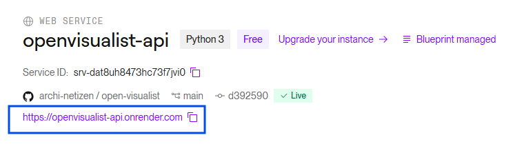
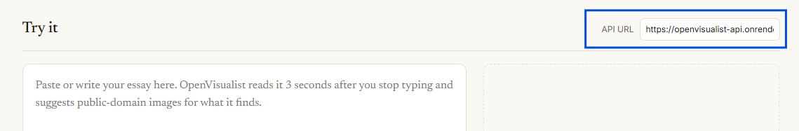

# OpenVisualist AI 

> **Context-aware image sourcing for the Public Domain. Stop generating. Start discovering.**

OpenVisualist is an AI-powered curation engine that bridges the gap between long-form writing and the world's vast archives of public domain imagery. Unlike generative AI which creates "synthetic" pixels, OpenVisualist acts as an autonomous librarian—reading your text, understanding the nuance, and sourcing real photography from history.

---

## The Vision
In an era of AI hallucinations, **OpenVisualist** prioritizes the "Provenance of the Real." It is designed for authors, historians, and publishers who need high-quality visuals without the legal or ethical ambiguity of generated art.

## How the AI Works
OpenVisualist doesn't just "search" keywords; it performs **Semantic Mapping**:
1. **Contextual Analysis:** The engine uses LLMs to parse your essay for themes, moods, and specific historical references.
2. **Visual Query Expansion:** It translates abstract concepts (e.g., "industrial melancholy") into concrete search parameters (e.g., "19th-century steel mill, low light, soot").
3. **Archive Sourcing:** It queries Public Domain APIs (Openverse, NASA, Wikimedia, Unsplash CC0) to find exact matches.
4. **Verification:** A secondary vision pass ensures the image composition aligns with the text's intent.

---

## View Mockup
https://kaushambimate.com/openvisualist-ai/

---

## Status

`api/` and `web/` are implemented and work together end-to-end today.
`wordpress-plugin/` and the multi-archive/verification steps under "How the
AI Works" above are still the vision, not yet built — see
`web/README.md` for the precise list of what's real vs. aspirational in the
current UI.

## Try it — no terminal needed

The front end is already live: **https://archi-netizen.github.io/open-visualist/**
(GitHub Pages, serving `index.html`). It needs a running backend to talk
to. Confirmed working end-to-end this way:

### No terminal, no problem — use Render

1. Click **[Deploy to Render](https://render.com/deploy?repo=https://github.com/archi-netizen/open-visualist)**
   (log in with GitHub, Google, etc.).
2. Sign in (free), click **Apply**. Nothing to configure —
   `render.yaml` handles it, and no API key is required.

   

3. Once it's live, Render shows you the service URL. Paste it into the
   **API URL** field on the [live page](https://archi-netizen.github.io/open-visualist/).

   

4. Start typing an essay. Three seconds after you pause, it should return
   real Openverse images.

That gets you real Openverse results with **zero secrets and zero cost** —
no `OPENAI_API_KEY` needed, because with none configured the backend uses a
simple word-frequency heuristic instead of the LLM for keyword extraction
(see `api/extraction.py`). It's cruder than real semantic understanding,
but it's enough to drive a search. Add an `OPENAI_API_KEY` later in
Render's Environment tab any time to switch to real LLM-based extraction —
no redeploy needed, Render restarts automatically.

Free-tier Render services sleep after inactivity; the first request after
that can take 30–60 seconds to wake up. That's normal, not a bug.

## Quickstart (running it yourself)

```bash
git clone https://github.com/archi-netizen/open-visualist
cd open-visualist

# Backend (needed either way)
python3 -m venv .venv && source .venv/bin/activate
pip install -r requirements.txt
cp .env.example .env   # OPENAI_API_KEY is optional — see "Try it" above
uvicorn api.main:app --reload --port 8000
```

Then pick a front end:

- **No build step:** open `index.html` directly in a browser (double-click
  it, or `python3 -m http.server` and visit it) — it talks to the API URL
  shown at the top of the page, which defaults to `http://localhost:8000`.
- **The full Next.js app**, with the nicer split-pane UI:
  ```bash
  cd web
  npm install
  cp .env.example .env.local
  npm run dev
  ```
  Then open http://localhost:3000.

Both front ends hit the same `/analyze-and-source` endpoint and render the
same thing — `index.html` is the zero-install option, `web/` is the fuller
build. See `web/README.md` for what the UI does and doesn't do yet.

## Repository Structure

```text
open-visualist/
├── api/                  # Python/FastAPI backend (The "Brain")
│   ├── main.py           # API entry point
│   ├── extraction.py     # LLM keyword harvesting + the no-key heuristic fallback
│   ├── sourcing.py       # Public Domain API integrations (Openverse)
│   ├── ratelimit.py      # Per-IP rate limit for the public endpoint
│   └── models.py         # Shared Pydantic request/response models
├── web/                  # Next.js front-end (split-pane UI)
│   ├── src/app/           # Pages (App Router)
│   ├── src/components/    # WritingZone, CurationZone, ImageCard, LicenseShield
│   └── src/lib/           # API client + shared types
├── wordpress-plugin/     # Planned — the "OpenVisualist Sync" WP integration (not built yet)
├── index.html            # Zero-build front end — open it directly, no npm needed
├── render.yaml           # One-click Render Blueprint for api/ (see "Try it" above)
├── design_logic.md       # UX/interaction spec the front-end is built against
├── .env.example          # Backend API keys (OpenAI, Openverse — both optional)
└── LICENSE               # MIT

